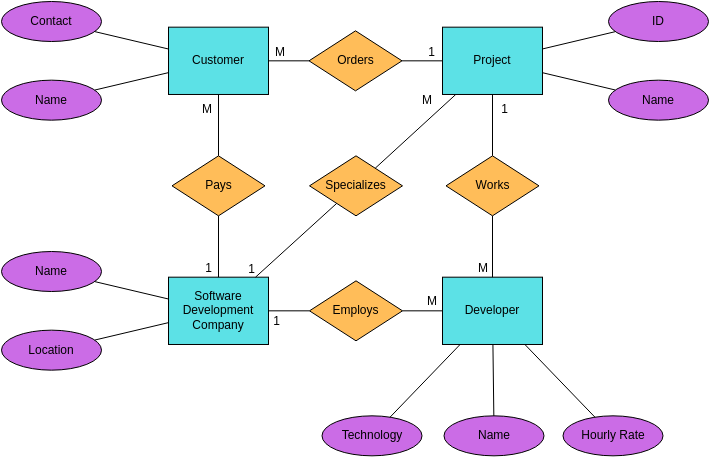
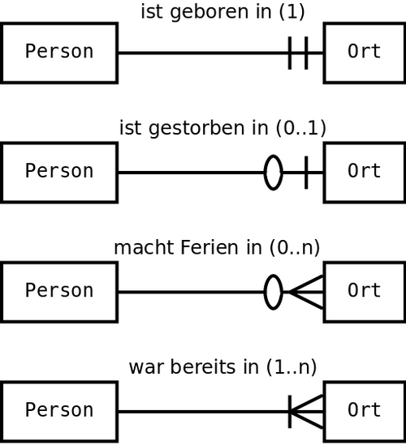
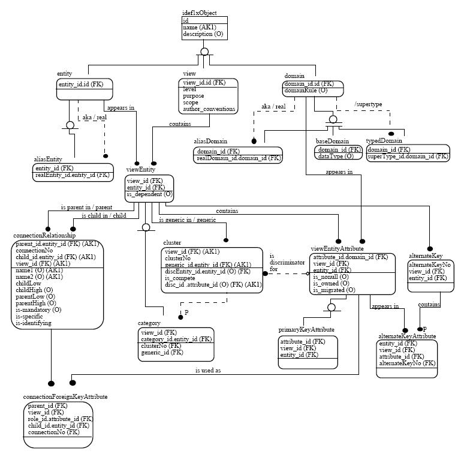
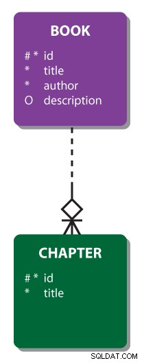

# Entity-Relationship-Diagramme (ERD)

Ein *Entity-Relationship-Diagramm* (ER-Diagramm oder ERD) ist eine visuelle Darstellung der Beziehungen zwischen Elementen in einer [[Databases (DE)|Datenbank]]. ERDs sind eine spezielle Art von Flussdiagrammen, die zeigen, wie verschiedene Objekte innerhalb eines Systems miteinander verbunden sind. Sie verwenden einen definierten Satz von Symbolen, darunter Rechtecke, Ovale und Rauten, die durch Verbindungslinien miteinander verknüpft werden.

Innerhalb des relationalen Datenbankmodells legen ERDs fest, wie Einträge in einer Datenbank miteinander verbunden sind. Sie bilden ein allgemeines konzeptuelles Datenmodell, das die Grundlage für fortgeschritteneres Datenbankdesign und -analyse schafft. Die Modellierung von Entitätsbeziehungen kann dabei helfen, Zusammenhänge und Erkenntnisse aus einer scheinbar unzusammenhängenden Sammlung von Datenpunkten zu gewinnen.

## Die Komponenten eines ERD

Entity-Relationship-Diagramme bestehen aus drei Hauptkomponenten: Entitäten, Attributen und Beziehungen. Einige ERDs zeigen zusätzlich die Kardinalität, die das Mengenverhältnis zwischen zwei Entitäten beschreibt.

### Entitäten

Eine **Entität** ist ein definierbares Objekt, wie eine Person, eine Rolle, ein Ereignis, ein Konzept oder ein Gegenstand, über das Informationen in einer relationalen Datenbank gespeichert werden können. In den meisten ER-Diagrammen werden Entitäten als Rechtecke dargestellt.

Beispiele für Entitäten sind *Personen oder Rollen* wie Studenten, Vertriebsmitarbeiter oder Kunden, *Ereignisse* wie Transaktionen oder Anmeldungen, *Konzepte* wie Profile oder Personas sowie *Objekte* wie Produkte, Rechnungen oder E-Mails.

Entitäten sind in einem grammatikalischen Sinne mit Substantiven vergleichbar. Sie sind die Kernelemente in der Datenbank, während Attribute und Beziehungen zusätzliche Informationen über diese Entitäten vermitteln, ähnlich wie Adjektive und Verben mehr Informationen über die Substantive in einem Satz liefern.

*Entitätstypen* sind Kategorien von Entitäten. Wenn Entitäten Substantiven ähneln, dann sind Entitätstypen Kategorien von Substantiven wie Lebensmittel, Sport oder Länder. Die einzelnen Entitäten innerhalb eines Entitätstyps werden als *Instanzen* bezeichnet. Innerhalb des Entitätstyps "Gemüse" könnten sich beispielsweise die Instanzen "Brokkoli", "Karotte" und "Spargel" befinden.

Entitäten werden entweder als *stark* oder *schwach* klassifiziert. Starke Entitäten enthalten genügend identifizierende Informationen in ihren Attributen, sodass keine weiteren Erläuterungen erforderlich sind. Schwache Entitäten hingegen existieren nur als Ergebnis oder Konsequenz einer anderen Entität. Ein Beispiel: In einer Datenbank für einen Online-Shop ist jede Bestellung eine starke Entität, da sie durch Käufer, Uhrzeit und Datum eindeutig definiert werden kann. Die einzelnen Positionen innerhalb einer Bestellung sind jedoch schwache Entitäten, da sie nur im Kontext ihrer jeweiligen Bestellung eine Bedeutung haben. Starke Entitäten werden als ausgefüllte Rechtecke dargestellt, während schwache Entitäten als doppeltes Rechteck erscheinen.

### Attribute

**Attribute** sind Eigenschaften, Qualitäten und Merkmale, die eine Entität oder einen Entitätstyp definieren. In einem klassischen ERD-Design werden Attribute als Ovale dargestellt und neben der entsprechenden Entität angezeigt.

Es gibt verschiedene Arten von Attributen. **Einfache Attribute** können nicht weiter vereinfacht oder aufgeteilt werden, wie beispielsweise eine Postleitzahl. **Zusammengesetzte Attribute** werden aus anderen Attributen zusammengestellt. Eine Adresse ist ein zusammengesetztes Attribut, das Hausnummer, Straßenname, Postleitzahl, Ort und weitere Informationen enthält. **Abgeleitete Attribute** werden auf Grundlage anderer Attribute berechnet. Der Wert eines Gehaltsschecks ergibt sich beispielsweise aus den geleisteten Arbeitsstunden, der Dauer der Gehaltsperiode und dem Stundenlohn. Abgeleitete Attribute werden als gestrichelte Ovale dargestellt. **Mehrwertige Attribute** können mehr als einen Wert pro Datensatz haben, ein Einzelwertattribut hingegen nicht.

**Schlüsselattribute** sind Attribute, die jede Entität in einem Datensatz eindeutig definieren. Der **Primärschlüssel** ist das Schlüsselattribut, das gewählt wird, um einen Entitätssatz eindeutig zu definieren. Da der Primärschlüssel jede Entität unterscheidet, dürfen keine zwei Einträge in einer Datenbank denselben Primärschlüsselwert haben. In einem ER-Diagramm wird der Primärschlüssel jeder Entität unterstrichen. Ein **Fremdschlüssel** ist ein Attribut, das die Beziehung einer Entität zu einer anderen identifiziert. Schwache Entitäten sind auf Fremdschlüssel angewiesen, um sie mit starken Entitäten zu verbinden.

### Beziehungen

**Beziehungen** sind die Verbindungslinien, die die Entitäten in einem ERD miteinander verknüpfen. Sie zeigen an, wie Entitäten innerhalb eines ERD miteinander verbunden sind. Wenn Entitäten Substantive sind und Attribute Adjektive, dann sind Beziehungen Verben. In einem traditionellen ERD werden Beziehungen als Rauten dargestellt.

Die *Kardinalität* ist die Eigenschaft einer Beziehung, die die Anzahl der Instanzen in einer Entität definiert, die sich auf die Instanzen einer anderen Entität beziehen. *Eins-zu-eins-Beziehungen* (1:1) bedeuten, dass ein Datensatz in einer Entität nur von einem einzigen Datensatz in der anderen Entität referenziert werden kann. Ein Beispiel: Die Beziehung zwischen Universitäten und ihren Präsidenten ist eine Eins-zu-eins-Beziehung, da jede Universität nur einen Präsidenten hat und jeder Präsident genau einer Universität vorsteht.

*Eins-zu-viele-Beziehungen* (1:N) beschreiben Situationen, in denen jeder Datensatz in einer Entität sich auf mehrere Datensätze in einer anderen Entität bezieht. Es besteht eine Eins-zu-viele-Beziehung zwischen Universitäten und Fachbereichen, da eine Universität mehrere Fachbereiche haben kann, aber jeder Fachbereich nur zu einer Universität gehört.

*Viele-zu-viele-Beziehungen* (M:N) zeigen, dass ein oder mehrere Datensätze innerhalb beider Entitäten verbunden werden können. Studenten und Professoren haben eine Viele-zu-viele-Beziehung, denn ein Professor unterrichtet viele Studenten, und jeder Student kann Kurse bei verschiedenen Professoren belegen.

## ERD-Notationsstile

Seit der Einführung von ERDs durch den Informatiker Peter Chen in den 1970er Jahren sind verschiedene Notationsstile entstanden, die unterschiedliche Anwendungsfälle abdecken.

Der *Chen-Stil* ähnelt klassischen Flussdiagrammen mit verschiedenen Formen, die durch Linien verbunden sind. Die Kardinalität wird durch die Zeichen "1", "M" und "N" entlang der Verbindungslinien dargestellt.

Die *Krähenfuß-Notation* ist nach ihrer dreizackigen, gegabelten Verbindungslinie benannt, die Viele-Beziehungen darstellt. Sie ersetzt Chens Symbole durch Tabellen, wobei jede Tabelle eine Entität repräsentiert und alle ihre Attribute enthält.

Die Diagramme in der Grafik unten lesen sich wie folgt:

- Eine Person ist geboren in minimal einem, maximal einem Ort.
- Eine Person ist gestorben in minimal Null, maximal einem Ort.
- Eine Person macht Ferien in minimal Null, maximal vielen Orten.
- Eine Person war bereits in minimal einem, maximal vielen Orten.
- In die Gegenrichtung wird keine Aussage über die Kardinalität gemacht.

Der *IDEF1X-Stil* wurde in den 1980er Jahren von der US Air Force eingeführt und zeigt Attribute innerhalb einer gemeinsamen Tabelle mit erweiterten Optionen für die Kardinalität.

Der *Barker-Stil* wurde 1981 von Richard Barker entwickelt und ist der Standard für Oracle-Datenbanken. Er verwendet die Krähenfuß-Notation für Verbindungslinien und nutzt gestrichelte Linien, um optionale Teilnahme darzustellen.

